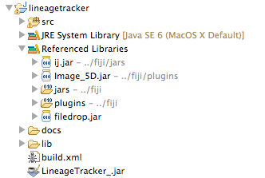
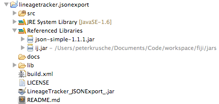

LineageTracker and JSON Export Development
==========================================

This is a brief outline of how to debug LineageTracker and this plugin in [Eclipse](http://www.eclipse.org/).

A LineageTracker
----------------

1. Get the LineageTracker source code from [http://www2.warwick.ac.uk/fac/sci/systemsbiology/staff/bretschneider/lineagetracker/](http://www2.warwick.ac.uk/fac/sci/systemsbiology/staff/bretschneider/lineagetracker/). Also, get [Fiji/ImageJ](http://fiji.sc/) (optionally the source code, though it's not strictly necessary). 
2. Get filedrop.jar from [http://iharder.sourceforge.net/current/java/filedrop/](http://iharder.sourceforge.net/current/java/filedrop/)
3. Make an Eclipse project for LineageTracker, and extract the source code into the project folder. Add `src` as a source folder. Fix the classpath to include these Jars:

   
4. Add `build.xml` (_change the target paths to Fiji to suit your needs!_) and add an Ant builder to run it:

```xml
<project name="LineageTracker_" default="main" basedir=".">
    <description>
        LineageTracker jar build file
    </description>
  <property name="src" location="src" />
  <property name="build" location="bin" />
  <property name="dist"  location="dist" />
 
  <!-- set this to the location of your FijI plugins path -->
	<property name="pluginsDir"  location="$basedir/../../fiji/plugins/" />
  <property name="user.name" value="Your Name" />
  <target name="main" depends="compress" description="Main target">
	<echo>
		Building the .jar files.
	</echo>
 </target>
 <target name="compress" depends="" description="generate the distribution">
 	<jar jarfile="LineageTracker_.jar">
 		<fileset dir="src" includes="plugins.config" />
		<fileset dir="${build}"> 
			<include name="**/*.*" />
		</fileset>
 		<manifest>
 		    <attribute name="Built-By" value="${user.name}"/>
 		</manifest>
 	</jar>
  </target>
</project>
```

This should build LineageTracker from source, package it into a Jar file, and copy this file into the Fiji Plugins directory.

B This Plugin
-------------

1. Clone this repository, add as project into Eclipse (there is a .project file):

```
git clone git@github.com:pkrusche/lineagetracker.jsonexport.git
```

2. Get [JSON-Simple](https://code.google.com/p/json-simple/). Here is 
   a link to the JAR file you will need: [http://json-simple.googlecode.com/files/json-simple-1.1.1.jar](http://json-simple.googlecode.com/files/json-simple-1.1.1.jar), put this file into the `lib` folder.
3. Fix the class/build path: 

   

4. This plugin includes a build.xml file (see above), you should change it to copy the output Jar archive to the correct destination (Fiji's plugins folder).

You can run/debug `src/(default package)/RunImageJ.java` as a Java application, it is a simple wrapper for starting ImageJ. 

Notes
-----

A main obstacle when debugging appears to be the way LineageTracker is loading plugins: it works around the standard classpath and loads them directly from the ImageJ plugins folder. This is why the build files above copy the Jars to this folder such that LineageTracker will use the right code.

